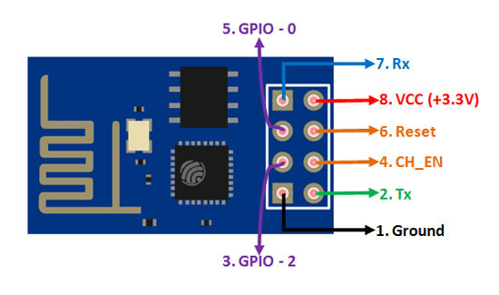
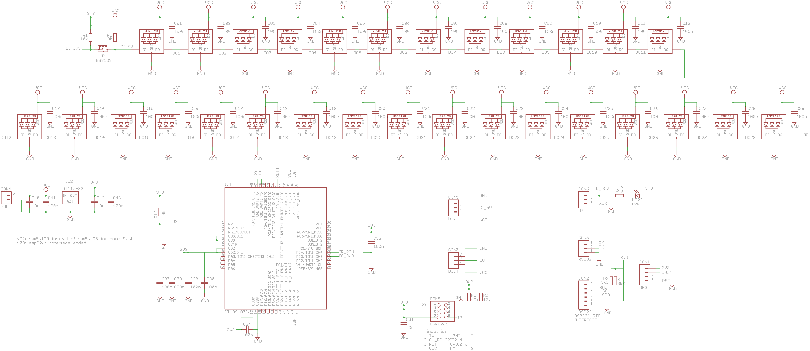

# Binary Clock SSD (Seven Segment Display) Project
- 6 x 29 WS2812B leds: 6 digits, 4 leds/segment, 1 decimal-point
- 6 PCBs (daisy-chain) are needed for time-display
- STM8S105C6T6 uC with 32K Flash, 2K RAM and 1024 bytes EEPROM
- IR (TL1838) receiver with led indication
- DS3231 Real-Time Clock (RTC)
- SWIM debug interface
- ESP8266 interface for reading date and time from NTP time-server

# IR-codes and commands
4 = Show temperature for 5 seconds.
5 = Set intensity of colors (01 - 39). Use Up, Down, Ok, 0-9 to set a digit.
6 = Invert blanking active/not-active signal (on=off, off=on) for 60 seconds.
7 = Test mode for 60 seconds.
8 = Set Blanking-begin time. Use Up, Down, Left, Right, Ok, 0-9 to set a digit.
8 = Set Blanking-end time. Use Up, Down, Left, Right, Ok, 0-9 to set a digit.
\# = Show date & year for 8 seconds.

# Development Environment
IAR development environment for STM8 

#ESP8266 Firmware
- Arduino 1.8.15 IDE with board "Generic ESP8266 Module"
- Connect GPIO_0 to GND for programming, to VCC for normal booting
- Connect GPIO_2 to VCC, leave RESET open and CH_PD to VCC.
- Connect Vcc to +3.3V
- Connect TX to RX and RX to TX of UART-adapter

 
*ESP01 Pinout*

# Schematic
 
*Schematic of Binary Clock SSD v03*